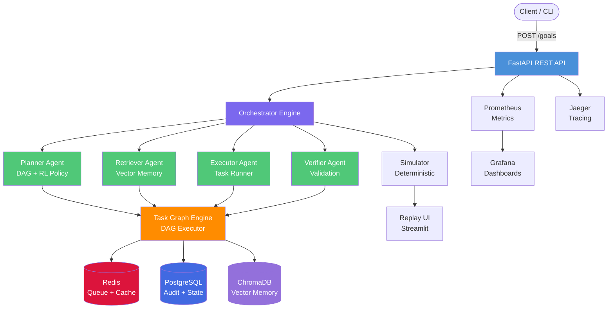

# Agentic Orchestrator

[](https://github.com/sourabh-virdi/agentic-orchestrator/actions/workflows/ci.yml)
[](https://codecov.io/gh/sourabh-virdi/agentic-orchestrator)
[](https://opensource.org/licenses/MIT)
[](https://hub.docker.com/r/sourabh-virdi/agentic-orchestrator)

**Turn strategic goals into sequenced, monitored actions — automatically.**

---

## Problem Statement

Modern campaign management demands coordinating dozens of interdependent actions across channels, audiences, and time windows. Manual orchestration is slow, error-prone, and impossible to audit. Existing workflow engines can execute predefined steps but cannot decompose abstract goals into concrete plans or adapt when tasks fail.

The Agentic Orchestrator bridges this gap: submit a high-level goal like *"increase Q2 email engagement by 20%"* and the system decomposes it into a dependency-aware task graph, executes it through specialized subagents, verifies results, and logs every decision for full auditability.

## Architecture



**How it works:**

1. **Goal Submission** — A client submits a strategic goal via the REST API with constraints (budget, timeline, channels).
2. **Planning** — The Planner agent decomposes the goal into a directed acyclic graph (DAG) of tasks using heuristic rules and an optional learned RL policy.
3. **Context Retrieval** — The Retriever agent searches persistent vector memory (ChromaDB) for relevant historical context and past campaign data.
4. **Execution** — The Executor agent processes tasks in topological order, respecting dependencies, with retry logic for transient failures.
5. **Verification** — The Verifier agent validates execution results against the original goal constraints, triggering re-planning if confidence is low.
6. **Audit & Replay** — Every decision is logged to an immutable PostgreSQL audit trail. The Replay UI (Streamlit) allows step-through debugging of any past execution.

## Quickstart

### Prerequisites

- Docker and Docker Compose v2+
- Python 3.11+ (for local development)
- 4 GB RAM minimum

### Run with Docker Compose

```bash
# Clone the repository
git clone https://github.com/sourabh-virdi/agentic-orchestrator.git
cd agentic-orchestrator

# Copy environment template
cp .env.example .env

# Start all services
docker compose up -d

# Verify services are running
curl http://localhost:8000/api/v1/health

# Submit a test goal
curl -X POST http://localhost:8000/api/v1/goals \
  -H "Content-Type: application/json" \
  -d '{
    "title": "Q2 Email Engagement Campaign",
    "description": "Increase email open rates by 20% for enterprise segment",
    "constraints": {
      "budget_usd": 5000,
      "deadline": "2026-06-30",
      "channels": ["email", "in-app"],
      "audience": "enterprise"
    }
  }'

# Open Replay UI
open http://localhost:8501
```

### Local Development

```bash
# Create virtual environment
python -m venv .venv
source .venv/bin/activate  # Windows: .venv\Scripts\activate

# Install dependencies
pip install -e ".[dev]"

# Start infrastructure
docker compose up -d postgres redis chromadb

# Seed sample data
python scripts/seed_data.py

# Run the API server
uvicorn src.api.main:app --reload --port 8000

# Run tests
make test
```

## Project Structure

```
agentic-orchestrator/
├── src/                    # Application source code
│   ├── api/                # FastAPI REST API
│   ├── agents/             # Subagent implementations
│   │   ├── planner.py      # Heuristic + RL planner
│   │   ├── retriever.py    # Vector memory retriever
│   │   ├── executor.py     # Task executor
│   │   └── verifier.py     # Result verifier
│   ├── core/               # Core orchestration engine
│   │   ├── orchestrator.py # Main orchestrator
│   │   ├── task_graph.py   # DAG engine
│   │   └── models.py       # Data models
│   ├── memory/             # Vector memory layer
│   ├── audit/              # Audit logging
│   ├── simulator/          # Deterministic simulator
│   ├── policy/             # Learned RL policy
│   └── replay/             # Streamlit replay UI
├── tests/                  # Test suite
│   ├── unit/               # Unit tests
│   ├── integration/        # Integration tests
│   └── e2e/                # End-to-end tests
├── infra/                  # Infrastructure as code
│   ├── terraform/          # Terraform configs
│   └── helm/               # Helm charts
├── data/                   # Synthetic data generators
├── models/                 # Model artifacts
├── notebooks/              # Jupyter notebooks
├── demo/                   # Demo scripts and notebooks
├── examples/               # Example usage
├── benchmarks/             # Load testing
├── scripts/                # Utility scripts
├── docs/                   # Documentation
└── .github/                # CI/CD workflows
```

## Key Commands

| Command | Description |
|---------|-------------|
| `make dev` | Start development environment |
| `make test` | Run full test suite |
| `make lint` | Run linters (ruff, mypy) |
| `make build` | Build Docker image |
| `make seed` | Seed synthetic data |
| `make train` | Run toy policy training |
| `make bench` | Run load tests |

## Documentation

- [Technical Specification](docs/spec.md)
- [Design Document](docs/design.md)
- [Operations Runbook](docs/ops.md)
- [API Reference](openapi.yaml)
- [Blog Post](docs/blog.md)

## Contributing

See [CONTRIBUTING.md](CONTRIBUTING.md) for guidelines.

## License

MIT License — see [LICENSE](LICENSE) for details.
